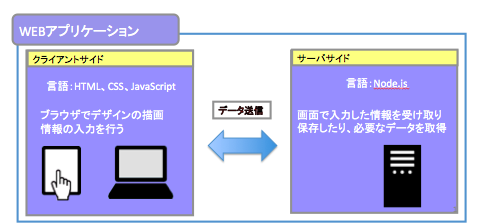

# テスト用

## WEBアプリとは
インターネットから利用するアプリケーションソフトウェア

### WEBアプリの構成
WEBアプリはクライアントサイド（フロントエンド）とサーバーサイド（バックエンド）の構成でできています。  
クライアントサイドではブラウザでデザインの描画を主に担当し言語はHTML、CSS、JavaScriptを使用して画面を作成します。  
対するサーバーサイドはユーザが画面で入力した情報を受け取り保存したり、必要なデータを取得する役割を担います。

 

以下よりセットアップしましょう。  
[VS Code インストール](./install-vscode-learning.md)

 
